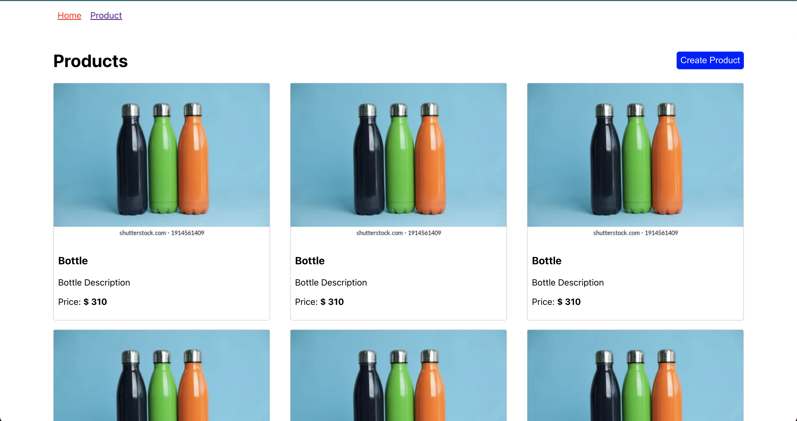
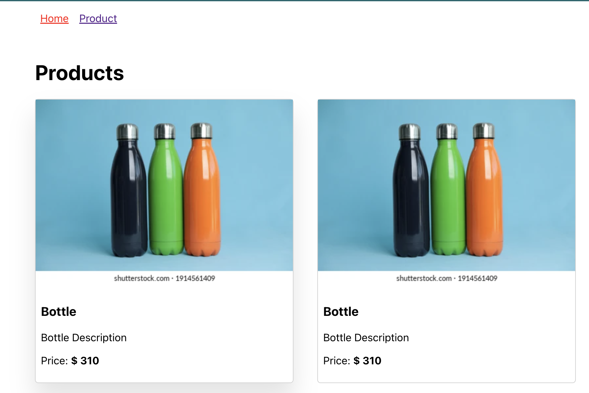

# Exercise 1

### Setup
1. create a react application - `npx create-react-app ecommerce-fe` 
2. Install react router package - `npm install react-router-dom@6`
3. Run `npm start` and you should see your application up and running.

## Goal

### Requirements
1. Have two pages `/` and `/products/:id`.
2. `/` page should return all the products (Match your output with the above image).
3. `/products/:id` should return `Coming Soon!` text.
4. Based on URL, the links should be automatically highlighted. HINT - Use `<NavLink>`
5. Keep the `Create Product` button dummy as of now.

### HINTS/TIPS
1. Break the Mockup into components before working on it.
2. Use flexbox to get the layout for Products.

### BONUS
1. Try to get the hover effect like below - 

